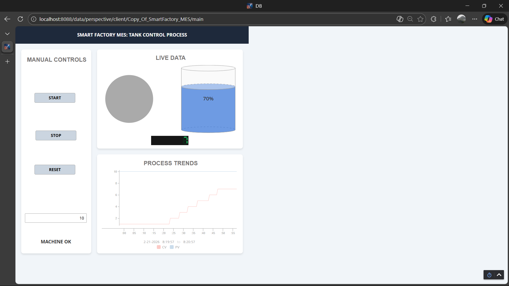
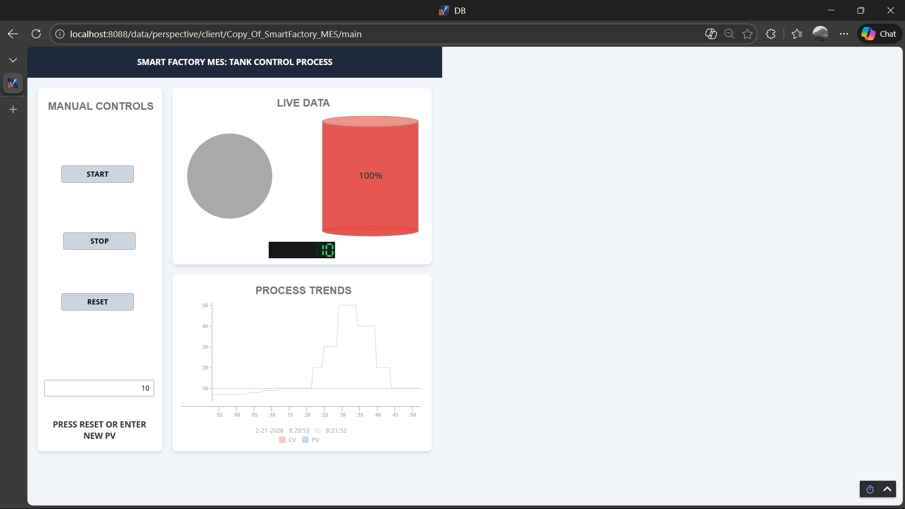

# 🏭 SMART FACTORY MES: High-Performance SCADA Pipeline


## 📋 Project Overview
An enterprise-grade, bidirectional Industrial IoT (IIoT) data pipeline and SCADA application. This system bridges the gap between **Operational Technology (OT)** and **Information Technology (IT)** by networking a virtual PLC through OPC UA middleware into an advanced web-based HMI. 

Designed to strictly adhere to **ISA-101 High-Performance HMI standards**, focusing on maximizing operator situational awareness, minimizing cognitive load, and optimizing database storage through exception-based historian logging.

---

## 📸 System Interface

### 1. Idle State (Machine Before Starting)


### 2. Active State (High-Level Alarm & Color Shift)


### 3. Dynamic Operator Prompt (PV Reset Message)


---

## ⚙️ Industrial Use Case
This architecture simulates a continuous **Tank Control Process** found in chemical, food & beverage, or water treatment plants. It functions as a complete operator interface and production monitoring pipeline.

**Key Benefits:**
* **ISA-101 Situational Awareness:** Employs grayscale UI methodology where vibrant colors are strictly reserved for active states (Green) and critical level alarms (Red).
* **Network Segregation:** Proves capability in routing data from a field control PLC layer, through middleware, to an IT supervisory layer.
* **Storage Optimization:** Utilizes **Exception Logging** to MySQL, ensuring data is only written during state changes to minimize database bloat.
* **Modern Web-App Layout:** Replaces traditional complex graphics with a clear, responsive "Card" layout, separating manual controls from process trends.

---

## 🧠 Core Engineering Features

### 🖥 The SCADA Gateway
* Configured using **Ignition 8.3**.
* Bidirectional control routing operator inputs (PV/Target Level) back down to the PLC.

### 📊 Historical Trending
* **Unified Datasets:** Combines Process Values (PV) and Control Values (CV) into a single, optimized Perspective Time Series Chart.
* **SQL Historian Suite:** Routes tags directly to the MySQL backend.

### 🗃 Middleware Protocol
* **Kepware OPC UA Server:** Translates native CODESYS tag data into secure, standardized OPC UA language for the SCADA layer to subscribe to.

---

## ▶ How to Deploy

### Requirements
* **Ignition Gateway** (Version 8.3+)
* **MySQL Server** (Running locally on port 3306 or network IP)
* *(Optional: CODESYS and Kepware for live data simulation)*

### Installation
1.  **Clone the repository:**
    ```bash
    git clone [https://github.com/Abijith0/SmartFactory-MES-SCADA-Pipeline.git](https://github.com/Abijith0/SmartFactory-MES-SCADA-Pipeline.git)
    cd SmartFactory-MES-SCADA-Pipeline
    ```
2.  **Restore the Project:**
    * Open your local Ignition Gateway web portal.
    * Go to **Config → System → Backup/Restore**.
    * Upload the `SmartFactory_MES_2026-02-22_1410.zip` file to restore the project and tag structure.
3.  **Connect the Database:**
    * Go to **Config → Databases → Connections**.
    * Create a new MySQL connection pointing to your historian database schema.
4.  **Launch the Session:**
    * Open the Ignition Designer, select the `Copy_Of_SmartFactory_MES` project, and click **Tools → Launch Perspective Session**.

---

## 📄 Project Files
- **[📥 Download the Ignition Project Export (.zip)](SmartFactory_MES_2026-02-22_1410.zip)** *This file contains the deployable Ignition 8.3 project, including the Perspective HMI UI, Tag configurations, and Historian connections.*

---

## 👨‍💻 Developer
**Abijith Harishkumar**
*Automation Engineer | Systems Integrator*

Focused on enterprise-level architecture, bridging the gap between **OT (Operational Technology)** and **IT** by combining PLC systems, OPC UA networks, and modern software development.

---

## 🧱 System Architecture

### 1️⃣ Network Architecture (OT → IT Data Flow)
This diagram outlines the physical hardware separation, proving network routing capability between the field OT layer and the supervisory IT layer.

```mermaid
graph TD
    subgraph PC1 [PC 1 - Field Operations OT]
        PLC[CODESYS Virtual PLC]
        OPC[Kepware OPC UA Server]
        PLC -- Raw Tag Data --> OPC
    end

    subgraph PC2 [PC 2 - Supervisory Control IT]
        IG[Ignition 8.3 Gateway]
        DB[(MySQL Database)]
        HMI[Perspective Web Client]
        
        IG -- Exception Logging --> DB
        IG -- WebSockets / HTTPS --> HMI
    end

    OPC -- OPC UA Protocol via LAN --> IG
